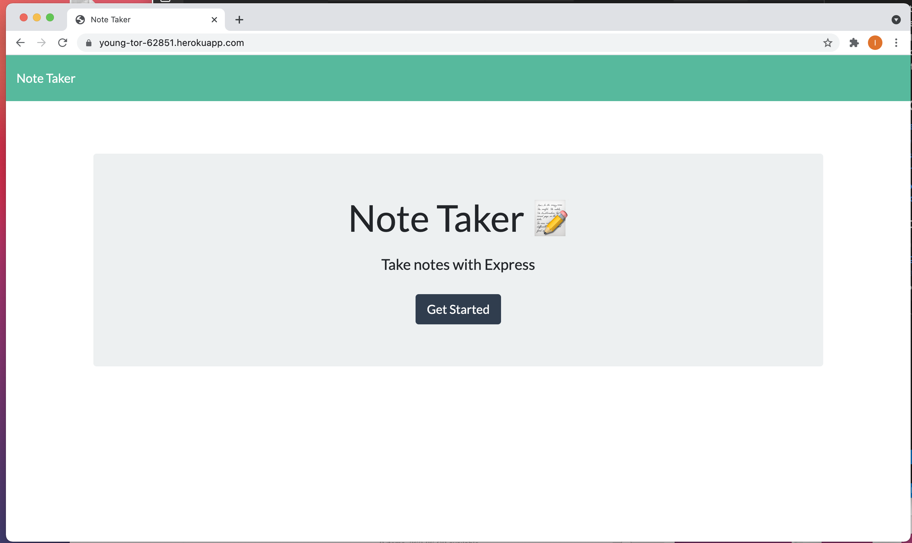
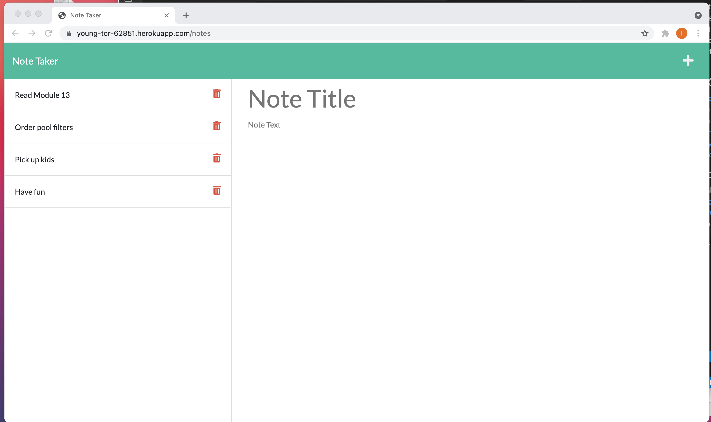

# My-Note-Taker [](https://opensource.org/licenses/MIT)
An app that can be used to write and save notes

## Technologies Used

* JavaScript (Node.js, Express.js)

## Description 

This application uses an Express.js back end and saves and retrieves note data from a JSON file. You can write and save notes to organize the thoughts and keep track of tasks you need to complete.

## Table of Contents 
- [Installation](#installation)
- [Usage](#usage)
- [License](#license)
- [Screenshots](#screenshots)
- [Deployed](#deployed)
- [Questoins](#questions)

  
## Installation 
This app is already deployed on heroku https://young-tor-62851.herokuapp.com, but if you want to install it locally, don't forget:
   ``` 
    npm init
    npm install express
    npm install uuid
   ```
  
## Usage
  Click on the link to the notes page and you will be presented with a page with existing notes listed in the left-hand column, plus empty fields to enter a new note title and the note’s text in the right-hand column. Enter a new note title and the note’s text and , then you can save tyour note using the icon at the top of the page . When you click on an existing note in the list in the left-hand column, then that note appears in the right-hand column. You also can delete a note using trash can icon.

## License 
  
  The MIT License


## Screenshots
  
   | 

## Deployed 
https://young-tor-62851.herokuapp.com/
   
## Questions
  If you hane any questions:
  
  Get in touch with me on Github [Irina-Golubitsky](https://github.com/Irina-Golubitsky)
  
  Email me irina.golubitsky@gmail.com

